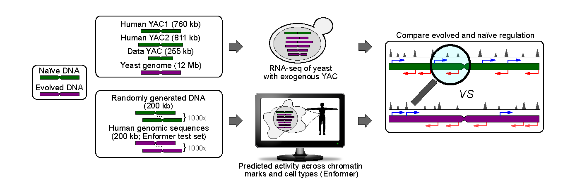

# RGP

The repo contains the scripts to recreate the human analysis portion for the the manuscript: Regulatory activity is the default DNA state in eukaryotes. Using the raw data provided a user can create their own shuffled sequence datasets using Biasaway and then produce downstream plots. Detailed information about the set up can be found in methods section here: https://www.biorxiv.org/content/10.1101/2022.12.16.520785v1.full

## Generating shuffled sequences 
Datasets can be found here: https://zenodo.org/records/10529931

To create shuffled sequence sets use `test_hg38_seqs_196kb.fasta` and biasaway (sample commands below). Test set regions (196kb each) with "N"s were filtered out to ensure proper shuffling and the surrounding flanking regions were added post shuffling. 

### Local Shuffling
To create local trinucleotide shuffled sequences use the following command with k = 3 (kmer), step size of 100bp and window size of 200bp:

`biasaway w -f /project/st-cdeboer-1/iluthra/enformer_random_DNA/enformer_data/test_hg38_seqs_196kb.fasta -k 3 -s 100 -w 200 > /project/st-cdeboer-1/iluthra/enformer_random_DNA/enformer_data/test_hg38_seqs_196kb_trinuc_local.fasta`

### Global Shuffling
To create global trinucleotide shuffled sequences use the following command with k = 3 (kmer):

`biasaway k -f /project/st-cdeboer-1/iluthra/enformer_random_DNA/enformer_data/test_hg38_seqs_196kb.fasta -k 3 > /project/st-cdeboer-1/iluthra/enformer_random_DNA/enformer_data/test_hg38_seqs_196kb_trinuc.fasta`

## Running Enformer to predict on shuffled sequence datasets

Enformer model weights and enviroment was installed using instructions from: https://github.com/google-deepmind/deepmind-research/tree/master/enformer

When predicting use the correctly padded test set sequence file: `test_hg38_seqs_393kb_N_flank.fasta`, `random_sequences.fasta` and other shuffled sequence datasets.

`qsub enformer_multi.pbs`

## Running analysis pipeline to create the figures from the paper

Plots in the paper can be recreated individually using each script separately or all the analysis (except Fig 4b) can be made using `RGP_plots.pbs` script. Input and output paths will need to be changed.

`qsub RGP_plots.pbs` 

To calculate the values used in Fig 4B. and Supplementary Figure 6 the script in the `/Evolution_plots_12cellTypes/` folder will be used.

`submitlog -m 10 -A st-cdeboer-1 -a ishika.luthra@ubc.ca -o /scratch/st-cdeboer-1/iluthra/randomDNA/Analysis_outputs_06152023/H1_DNase_rep1_07052023/Evolution_plots_12cellTypes//doExample1.olog -t RGP_cell_types_annotation_file.csv  ./submitlog.sh RGP_cell_types_annotation_file.csv`

To create the barplots in Fig 4B. and Supplementary Figure 6 use: `create_80percent_barplot.py`

## Questions

Feel free to contact Ishika Luthra (ishika.luthra@ubc.ca) regardings questions or help.

## References
Khan, A., Riudavets Puig, R., Boddie, P. & Mathelier, A. BiasAway: command-line and web server to generate nucleotide composition-matched DNA background sequences. Bioinformatics 37, 1607–1609 (2021).

Avsec, Ž. et al. Effective gene expression prediction from sequence by integrating long-range interactions. Nat Methods 18, 1196–1203 (2021).
